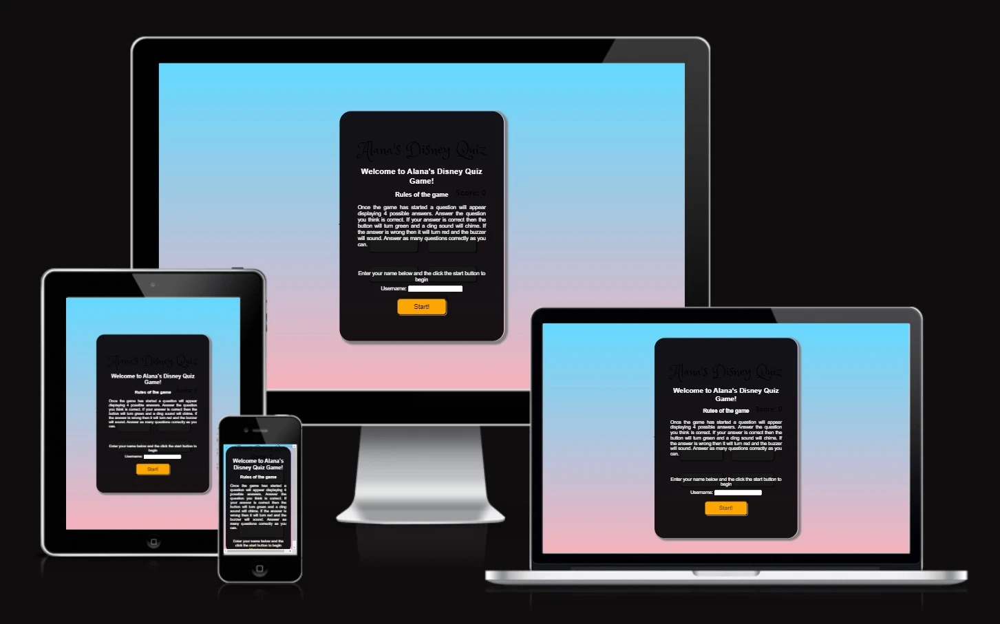

# Alana's Disney quiz game

This game was originally developed for my daughter who is a fan of Disney. However, the questions are generic. Therefore, the target audience is any young child who is a Disney fan and can read or be helped along the way.
It is a quiz game based on Disney questions and has 4 possible answers. 

Please click the link to visit the page: 

## Features

### The Rules

At the start, the rules are displayed. This demonstrates how the game should be played. There is a field to enter a username followed by the start button. The user should enter a username and then click start as described in the rules. If no username is entered, then an alert appears to ask the user to enter a username. The game will not start if a username is not entered. 

Once a username is selected, the alert confirms this by saying hello to the user with the name provided.

### The game

Once the game has started, a question is displayed in the question area and four buttons provide the possible answers, of which one is correct. 
The user clicks on the answer they think is correct.

### Response

Once the user selects their answer, the response is shown in two ways. A visual and audible reply tells the user if they are correct or not. Both the sound and colour are clear and obvious universal cues with accessibility in mind.
- The correct answer shows a green background on the button and triggers a ding (correct) sound.
- The incorrect answer shows a red background on the button and triggers a buzzer (incorrect) sound.

Once an answer is selcted, there is a 3 second delay in order that the user can clearly see and hear the response. During this time, no other buttons can be pressed. 

### Correct Answers

The number of correct answers given by the user are displayed on the page. This counts the number of correct answers given by the user.

The game can be restarted at any time by clicking on the Restart button. This will also rest the number of correct scores to 0.

### Ending the game

When the quiz is finished, the user is presented with the result! Depending on the score, the user will either be congratulated, commiserated or told not bad, try again. The username entered at the start will be displayed followed by the score. A different sound effect is also played depending on the score. This greatly adds to the user experience because the result is very personal. 

## Features left to implement

- counter- adding a timer to finish the game.
- Difficulty level in questions
- randomising questions

## Design

- color scheme/ childrens colors

- The font used for the main heading is Princess Sofia
- The main general fonts used are Arial, Helvetica, sans-serif
- No wireframe software was used in the design. The design was scripted on pen and paper
- UI/UX principles were taken into account during the design process and were the reason for design and colour scheme and theme.
- The main colours used in the design are childrens colours, pink and blue. The main backround is a gradient of the two colours. 

## Technologies used

- HTML5
- CSS3
- Javascript

## Frameworks, libraries and programs used

- Codeanywhere - To write the code
- Git - Version control
- Github - Deployment and storage of files online
- Google Fonts - To select and import fonts online
- Am I responsive - To show a screenshot of the responsive design across multiple devices
- Favicon - provides icons for the title bar
- pixabay - Provides sound clips

## Testing

The W3C Markup Validator, W3C CSS Validator and JSHint services were used to validate every page of the project to ensure there were no errors.

[WC3 Markup validator](https://validator.w3.org/)
[w3c CSS validator](https://jigsaw.w3.org/css-validator/)
[JSHint](https://jshint.com/)

### Validation Results

- HTML- No errors were returned 
- CSS- No errors returned
- JSHint- suggested that there was one unused variable, checkAnswer. This is because the function is called on click represented in the HTML. No errors returned. 

### Manual Testing

- The website was tested on Chrome, Edge, Firefox and Safari
- This was tested on an Apple Macbook pro and Windows surface pro 7 laptop, ipad mini, iphone XR, Honer 70 and Huawei p30 pro
- Dev tools was used to test various screen sizes

### Lighthouse Report

- The lighthouse report showed exemplary accessibility scores for mobile and desktop
  

### Bugs

| Test | Expected result | Actual Result | Fix | pass/ fail |
|------|-----------------|---------------|-----|------------|
|Repeatedly click on the correct answer|Next question appears and updates the score by +1|The score increases by the number of times clicked|Add function to disable and enable buttons between questions|Pass|
|Click an answer, then quickly click restart before next question is displayed|Next question is displayed|Next question gets replaced by a random question|Add to the function to disable/enable buttons until next question|Pass|
|Enter no username at start and click start|Alert for username and remain on rules screen|Move to first question|Add function to validate entry and remove event listener which listened to click to start next question|Pass|

### Unfixed bugz

- No outstanding unfixed bugs

## Deployment

GitHub Pages was used to deploy live versions of the website.

1. Log in to GitHub and locate [GitHub Repository Alana's Disney quiz game](https://github.com/TrisPatt/Disney-quiz-game)
2. At the top of the Repository(not the main navigation) locate "Settings" button on the menu.
3. Scroll down the Settings page until you locate "GitHub Pages".
4. Under "Source", click the dropdown menu "None" and select "Main" and click "Save".
5. The page will automatically refresh.
6. Scroll back to locate the now-published site [link](https://trispatt.github.io/Disney-quiz-game/) in the "GitHub Pages" section.

### Forking the GitHub Repository

By forking the repository, we make a copy of the original repository on our GitHub account to view and change without affecting the original repository by using these steps:

1. Log in to GitHub and locate [GitHub Repository Alana's Disney quiz game](https://github.com/TrisPatt/Disney-quiz-game)
2. At the top of the Repository(under the main navigation) locate "Fork" button.
3. Now you should have a copy of the original repository in your GitHub account.

### Local Clone

1. Log in to GitHub and locate [GitHub Repository Alana's Disney quiz game](https://github.com/TrisPatt/Disney-quiz-game)
2. Under the repository name click "Clone or download"
3. Click on the code button, select clone with HTTPS, SSH or GitHub CLI and copy the link shown.
4. Open Git Bash
5. Change the current working directory to the location where you want the cloned directory to be made.
6. Type `git clone` and then paste The URL copied in the step 3.
7. Press Enter and your local clone will be created.

## Credits
- Disney is a registered trademark. 

### Content
- All content is written by the developer.
  
### Code
- Readme template supplied by the code institute
- overlap code referenced at w3 schools
- local storage researched at mdn webdocs